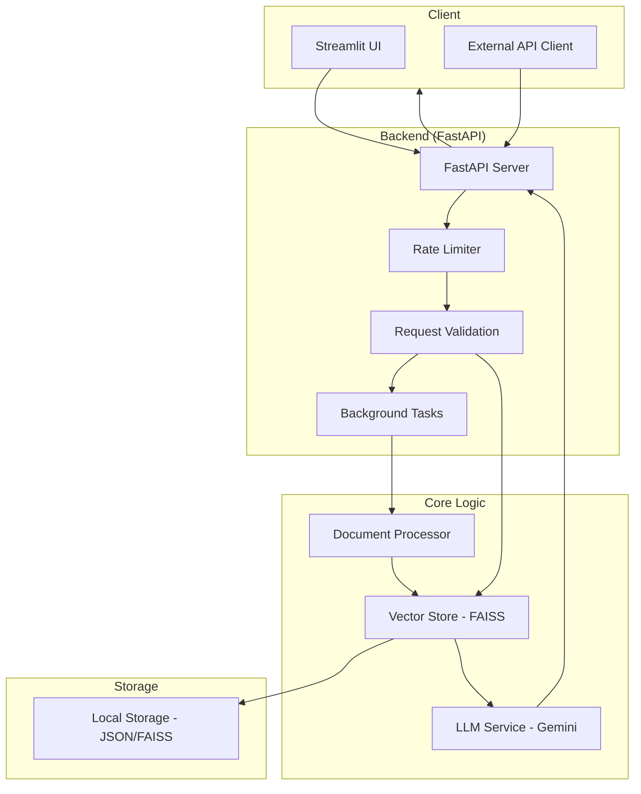

# System Architecture

The Knowledge Nexus RAG System follows a modular architecture designed for high performance and scalability.

## Component Breakdown

1.  **FastAPI Server**: Acts as the central hub, exposing endpoints for document upload and querying. It runs on a background thread within the Streamlit process.
2.  **Rate Limiter**: Uses `slowapi` to prevent abuse of the API.
3.  **Document Processor**: Handles text extraction from PDF/TXT files and performs semantic chunking.
4.  **Vector Store (FAISS)**: Uses `SentenceTransformer` to generate embeddings and FAISS for efficient similarity search.
5.  **LLM Service**: Connects to Google's Gemini 1.5 Flash to synthesize answers based on retrieved context.
