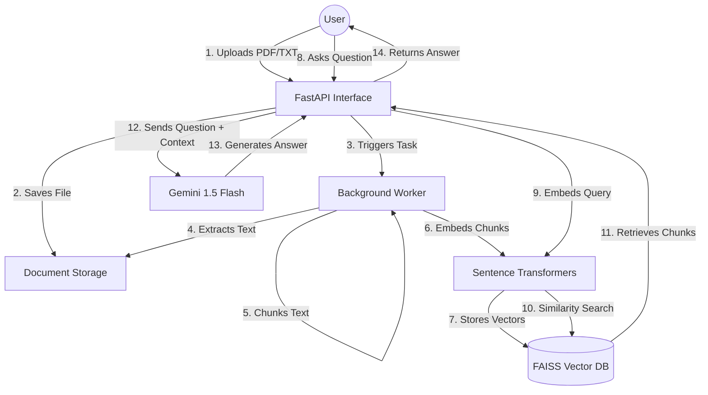

# System Architecture

## Overview

The system follows a classic RAG architecture, leveraging FastAPI for the web layer, FAISS for the retrieval layer, and Gemini for the generation layer.

## Component Diagram (Mermaid)

## Workflow Detail

1.  **Ingestion Phase**:
    - The user uploads a file.
    - The system saves it temporarily and returns a "success" response immediately.
    - A background task handles the extraction of text from PDF/TXT using `PyMuPDF`.
    - Text is broken into manageable chunks (1000 chars).
    - Each chunk is converted into an embedding (384-dim vector).
    - Vectors and metadata are stored in a local FAISS index.

2.  **Query Phase**:
    - The user sends a natural language question.
    - The question is converted into the same embedding space.
    - FAISS performs an L2 distance search to find the top 4 most similar chunks.
    - These chunks are formatted into a prompt for the Gemini LLM.
    - The LLM synthesizes an answer based _only_ on the provided context.
    - The answer and sources are returned to the user.
